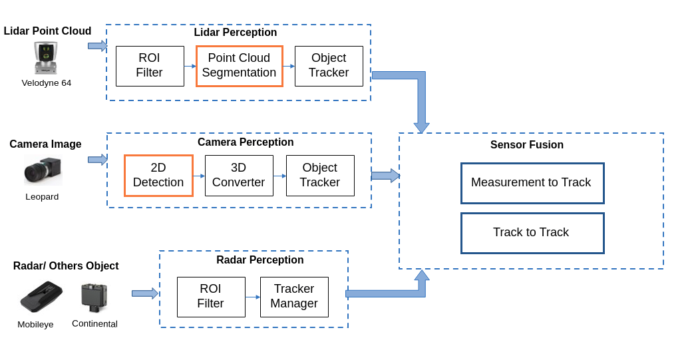

# Apollo Perception Standalone in ROS

[Apollo](https://github.com/ApolloAuto/apollo) is the most mature and sophisticated autonomous driving platform that is open source right now. 

However, there are some limitations.
  * Apollo (r3.0) is built upon a customized ROS environment, which is not compatible with normal ROS packages / plugins. 
  * Apollo (r3.5) abandons ROS and uses Cyber RT instead. 
  * If you want to understand their code and test it with your own application, you will need to have a good understanding of their framework before you can make any modifications.

Have you wondered, what if **everything can be run as a standard ROS node** and you can use all the familiar tools that are available in ROS? Then this repository is what you need!

|  | 
|:--:| 
| **Apollo Perception Architecture** |

|  | 
|:--:| 
| **Perception with demo-2.0.bag** |

The obstacle perception module in Apollo (r3.0) is extracted and modified so that it can be run as a normal ROS node. Everything is inside docker environment. Detailed steps of building and running the perception module are listed as follows.

I myself find learning Apollo's approach in perception very beneficial to helping me understand how the perception architecture is set up. I hope you find this repo useful as well.

**All contributions are welcome!!** There are so many things that can be improved. Please raise issues and/or make pull requests if you would like to work on it too. Thank you.

## Environment Information
The system is tested on Nvidia GeForce GTX 1080 Ti and 1070 Max-Q. Please install **Nvidia Driver**, [**Docker**](https://docs.docker.com/install/linux/docker-ce/ubuntu/), and [**Nvidia Docker**](https://github.com/NVIDIA/nvidia-docker).

| **Dependencies**                  	| Image Environment  	|
|-----------------------------------	|--------------------	|
| Nvidia Driver (Tested on 384.130) 	| Ubuntu 14.04       	|
| Nvidia Docker (Tested on 2)       	| Cuda 8.0 + Cudnn 7 	|

## Building and Running
1. Clone Repository in Host
```
mkdir ~/shared_dir && cd ~/shared_dir
git clone https://github.com/cedricxie/apollo_perception_ros
```

2. Pull Dokcer Image  
```docker pull cedricxie/apollo-perception-ros```

3. Enter Docker Container  
```cd ~/shared_dir/apollo_perception_ros && ./docker/run.sh```

4. Make ROS Packages
```
cd ~/shared_dir/apollo_perception_ros/
catkin build
source devel/setup.bash
```

5. Launch Perception Node  
```roslaunch vehicle_base detect_sim.launch```

6. Playback Demo-2.0.bag from Apollo  
```rosbag play demo-2.0.bag --clock```  
The bag can be downloaded at [Apollo Data Open Platform](http://data.apollo.auto), Vehicle System Demo Data, with file name ```demo-sensor-data-apollo-2.0.tar.gz```.

## Known issues
1. During building process, an error such as follows might occur. Usually do ```catkin build``` again can skip the problem. I am still trying to figure out how to complete solve it. Let me know if you find out a solution.
```
/usr/include/c++/4.8/bits/c++0x_warning.h:32:2: error: #error This file requires compiler and library support for the ISO C++ 2011 standard. This support is currently experimental, and must be enabled with the -std=c++11 or -std=gnu++11 compiler options.
```

2. Continental radar detection messages are in Protobuf format inside the ROS bag. Therefore it is not currently supported. However if you have your own radar, you can utilize the modest radar detector in the perception module to integrate into the system.

## To Do:
1. Add ego motion compensation.
2. Add sequence type fuser
3. Add Prediction / Planning modules.
